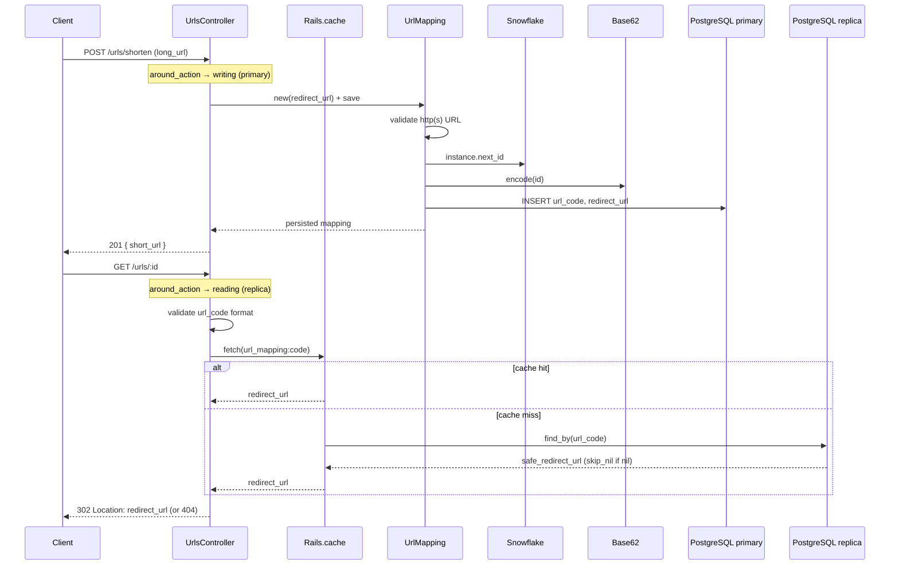

# Case study: URL shortener

Short links: create a mapping from a long URL to a compact code, then redirect on visit.

Rails 8 API app (PostgreSQL). Algorithm deep dives live in [`app/services/snowflake/README.md`](app/services/snowflake/README.md) (Snowflake) and [`app/services/utils/README.md`](app/services/utils/README.md) (Base62).

## Main problem

Accept a long URL, persist a **unique** short code, and redirect visitors to the stored destination when they request `GET /urls/:code`.

## Goals

1. User submits a long URL and gets a short URL back.
2. Visiting the short URL redirects to the long URL.
3. Handle **100 million new URLs per day** and **10 billion redirects per day**.
4. Keep redirects fast and highly available.

Those scale numbers imply a write-heavy create path (~1.2k/s average, much higher at peak) and a far more read-heavy redirect path (~115k/s average). ID generation must not serialize on a single database sequence, and redirects must usually miss the primary.

## Underlying problems

- **Code generation:** How do we produce a unique `url_code` without a hot “does this slug exist?” loop on every create?
- **Persistence:** What do we store (long URL only vs metadata)? How do we index for fast lookup on read-heavy traffic?
- **Redirect semantics:** Which HTTP status should the redirect use so browsers and intermediaries behave predictably (especially if analytics are added later)?
- **Read/write scale:** Redirects dominate; how do caching, a read replica, and rate limits keep the primary writable and the redirect path available?

## Design notes

1. **One row per create:** Each submitted long URL gets its **own** short link, even if another row already points at the same `redirect_url`. There is no deduplication—by design, so every share gets a distinct slug and (future) visit stats.
2. **Redirect-only product surface:** The short URL does not render content; it only resolves `url_code → redirect_url` and issues an HTTP redirect. No HTML, no personalization in the current scope.

## Handling reads vs writes

Creates must hit a **primary**. Redirects are read-only and should not compete with writes on that same instance.

[`ApplicationRecord`](app/models/application_record.rb) declares the two roles in development and production (not in test):

```ruby
connects_to database: { writing: :primary, reading: :primary_replica } unless Rails.env.test?
```

[`ApplicationController`](app/controllers/application_controller.rb) picks the role per request with `connected_to` — **GET/HEAD → replica**, everything else → **primary**. No session, no cookies: this is an API-only app, and the default Rails `DatabaseSelector` (`Resolver::Session`) needs a session store we do not want to add back.

```ruby
around_action :route_to_correct_database

def route_to_correct_database
  return yield if Rails.env.test?

  role = request.get? || request.head? ? :reading : :writing
  ActiveRecord::Base.connected_to(role: role) { yield }
end
```

- **Writes** (`POST /urls/shorten`) go to `primary`.
- **Reads** (`GET /urls/:id` cache misses) go to `primary_replica`.

Replica hosts/users are in [`config/database.yml`](config/database.yml) (`primary` + `primary_replica` in **development** and **production**). Test is **primary only** — no replica config, no `connected_to` switch — so request specs and transactional fixtures share one connection. `GET /up` uses Rails’ health controller, not `ApplicationController`, so it does not go through this switch.

### Why test has no replica

RSpec uses **transactional fixtures**: each example inserts on the writing connection inside a transaction, then rolls back. A replica (or even a second pool to the same Postgres) is a **different connection**. It cannot see those uncommitted rows, so `POST`/`create` then `GET` 404s or fails to connect — that is a test-harness lie, not a product bug. Making a standby honest in specs means dropping transactional fixtures, waiting on WAL, and running a second Postgres in CI. A local replica also will not reproduce production lag (apply is milliseconds). Request specs should prove create-then-redirect on **one** connection; replica routing stays development/production. First-click 404 from lag is [issue 1](#1-high-first-redirect-after-create-can-404-replica-lag), not something `bundle exec rspec` is meant to catch.

**Replica lag:** a code created and visited before the replica catches up can 404. The Rails session-based 2-second “read your writes” delay would not help much here anyway — the creator’s POST and a visitor’s GET are usually different clients. Caching on the redirect path (below) absorbs repeat reads; the replica mainly needs to keep up with *new* codes. Tracked as [issue 1](#1-high-first-redirect-after-create-can-404-replica-lag).

## Collision handling

`UrlMapping` inserts the encoded Snowflake id directly. There is no check-then-insert loop (that has a race under concurrent writers).

Uniqueness is enforced at two layers:

1. **Snowflake** — process-scoped generator with a mutex; collisions only arise if two processes share a `machine_id` and mint the same timestamp+sequence.
2. **Unique index on `url_code`** — last-resort DB backstop.

There is **no** application-level `ActiveRecord::RecordNotUnique` retry today. A true collision would fail the create. Collision probability is low when machine ids are unique; adding a bounded insert-retry would be the hardening step if machine-id uniqueness is not guaranteed.

## Limitations (current scope)

- Short URLs are **only** redirects. Nothing is generated or rendered from the slug beyond the lookup.
- Behavior is **deterministic and stateless** at the edge: no auth, no per-user variation, no A/B logic.
- **Machine id** is the trailing digits of the hostname. That is enough for one process per host/pod; Puma workers on the same host still share that ordinal (see Snowflake follow-ups).

## Future additions (not implemented)

- **Analytics:** Log or store visits per `url_code` (requires redirects to hit the app—see [302 vs 301](#redirect-302-found-vs-301-moved-permanently) below).
- **Insert retry** on `ActiveRecord::RecordNotUnique` with a small attempt cap.
- **Unique Snowflake `machine_id` per worker / cluster** (fold in Puma worker index, or lease ids from the DB).

## ID generation: options considered

### 1. Random code + collision check

Generate a random string (e.g. 7 chars from `[a-zA-Z0-9]`), check if it exists, retry on collision.

- **Pros:** Simplest to reason about; no bit-packing or coordination needed.
- **Cons:** Collision probability rises as the table fills; naive "check-then-insert" has a **race condition** under concurrent writers (two requests can both check, both see "free," both insert). Fix is to let the DB's unique constraint catch it via insert-then-rescue, not check-then-insert.

### 2. Database auto-increment + Base62

Use the DB serial, encode with Base62, use that as `url_code`.

- **Pros:** Simple; no separate id service; uniqueness is natural.
- **Cons:** **Predictable** slugs—without auth, anyone can increment/guess encoded ids and hit others’ destinations. **Hard to scale writes** across many app nodes if the DB is the single sequence source. Extra **existence checks** are unnecessary if the sequence is authoritative, but the predictability and DB coupling remain.

### 3. UUIDs

- **Pros:** Opaque, distributed-friendly.
- **Cons:** Long strings (even hex / Base62 UUIDs)—works against “short” URLs.

### 4. Snowflake-style ids (chosen)

64-bit (integer) ids: timestamp + machine + sequence bit fields; encode with Base62 for the path segment.

- **Pros:** Sortable-ish by time, no DB round-trip to “reserve” an id, compact slug after Base62, low collision rate when the generator is used correctly. Fits the 100M creates/day goal without a global sequence bottleneck.
- **Cons:** Requires correct **machine id** and **single generator lifecycle** per process (or per pod) in production; custom epoch and bit layout must stay stable once deployed.

Implemented in [`app/services/snowflake/generator_service.rb`](app/services/snowflake/generator_service.rb); slug encoding in [`app/services/utils/base62_service.rb`](app/services/utils/base62_service.rb). On create, [`UrlMapping`](app/models/url_mapping.rb) runs `encode(Snowflake::GeneratorService.instance.next_id)`.

`new` is private. One generator is memoized per process. Puma’s `before_worker_boot` hook calls `reset!` after fork so workers do not reuse the parent’s mutex and sequence.

### 5. Range / block allocation

A central coordinator assigns each server a numeric range (e.g. Server A: `1_000_000..2_000_000`, Server B: `2_000_001..3_000_000`). Each node allocates from its local pool without hitting the DB for every id.

- **Pros:** Very fast creates at scale; predictable load on coordinator.
- **Cons:** **Coordinator dependency**; **lost ranges** if a node dies or redeploys and discards its block—gaps are acceptable for urls but the ops story is harder, especially with **frequent deploys** when a server restarts and requests a new block while the old block is unused.

**Why Snowflake for this repo:** Good balance of short codes, no central allocator in the experiment, and no guessable sequential slugs—without accepting UUID length.

## Caching frequently accessed codes

The redirect path (`GET /urls/:id`) is read-heavy. [`UrlsController#show`](app/controllers/urls_controller.rb) checks `Rails.cache` before querying PostgreSQL (and therefore before the replica).

**Lookup flow**

1. Reject blank or malformed `url_code` values (must match `UrlMapping::URL_CODE_FORMAT`: 4–11 alphanumeric characters) with **404** — no cache or DB access.
2. `Rails.cache.fetch(UrlMapping.cache_key(code), expires_in: 1.hour, skip_nil: true)` — on miss, load `UrlMapping.find_by(url_code:)` and cache `safe_redirect_url`.
3. **`skip_nil: true`** — do not cache misses, so a code created after an initial failed lookup is found on the next request.
4. **Invalidation** — [`UrlMapping`](app/models/url_mapping.rb) deletes the cache entry on destroy and when `redirect_url` or `url_code` changes.

**Cache store by environment**

| Environment | Store | Notes |
|-------------|-------|-------|
| **Development** | Redis (`redis_cache_store`) | Requires local Redis; see [App setup](#app-setup). Shared across Puma workers. Falls back to `redis://127.0.0.1:6379`. |
| **Production** | Redis (`redis_cache_store`) | Requires `REDIS_URL` (no default). Shared across app servers so hot codes skip PostgreSQL. |
| **Test** | `:null_store` in config; request specs swap in `MemoryStore` where needed | No Redis. |

Entries expire after **one hour** via `expires_in`. There is no application-level LRU.

For 10B redirects/day, a shared Redis cache in front of the replica is the intended pattern: hot codes never touch PostgreSQL. Development and production both use Redis for that. The `solid_cache` gem and production `cache` database remain in the repo (Rails 8 Solid stack leftovers) but are not the `Rails.cache` store.

## Redirect: `302 Found` vs `301 Moved Permanently`

In [`UrlsController#show`](app/controllers/urls_controller.rb) the app uses **`302 Found`** (`status: :found`), not `301`.

| Status | Typical client behavior | Impact on this app |
|--------|-------------------------|-------------------|
| **301** | Browsers and some caches **store** the redirect target; later visits may **skip your server** and go straight to the long URL. | **Analytics and visit counts** on the short link stop seeing traffic; changing the destination later is harder for cached clients. |
| **302** | Treated as **temporary**; clients usually re-request the short URL. | Each click can hit the controller again—better if you add **analytics**, revoke links, or change targets. |

External hosts are allowed via `allow_other_host: true` because destinations are user-supplied `http`/`https` URLs validated on create.

## Rate limiting

[`config/initializers/rack_attack.rb`](config/initializers/rack_attack.rb) throttles by IP (counters live in `Rails.cache`):

| Path | Limit |
|------|-------|
| `POST /urls/shorten` | 50 requests / minute / IP |
| `GET /urls/:code` | 1000 requests / minute / IP |
| `GET /up` | Safelisted (not throttled) |

Over limit returns **429** `{ "error": "Rate limit exceeded, try again later" }`.

## Flow



## Database design

Table: **`url_mappings`**

| Column | Type | Notes |
|--------|------|--------|
| `url_code` | `string`, NOT NULL | Public slug (Base62 snowflake id); lookup key for redirects |
| `redirect_url` | `string`, NOT NULL | Full `http`/`https` URL; app caps length at `UrlMapping::MAX_REDIRECT_URL_LENGTH` (**2048**) |
| `created_at` / `updated_at` | `datetime` | Standard Rails timestamps |

**Indexes**

- **Unique index on `url_code`** (`index_url_mappings_on_url_code`): enforces uniqueness at the DB layer and supports fast `find_by(url_code: …)` on the redirect path (O(log n) btree lookup vs full scan).

We do **not** store the raw snowflake integer separately; only the encoded slug. Reversing the id is possible via Base62 decode if ever needed for debugging.

**Not stored (yet):** visit counts, owner user id, expiry, soft delete flags.

## API

| Method | Path | Request | Success | Error |
|--------|------|---------|---------|-------|
| `POST` | `/urls/shorten` | Param **`long_url`** (form/query/body param) | **201** JSON `{ "short_url": "<app url>/urls/<code>" }` | **422** `{ "error": [ "..."] }` validation messages |
| `GET` | `/urls/:id` | `:id` = `url_code` | **302** `Location: redirect_url` | **404** empty body if unknown code |

Rails routes: `resources :urls, only: [:show]` plus collection route `post :shorten`. Health check: `GET /up`.

## Validation and security

On create, `redirect_url` must be a **String**, present, at most **`MAX_REDIRECT_URL_LENGTH` (2048)** characters, and parse as **`URI::HTTP` / `URI::HTTPS`** with a non-empty **host** (see `long_url_must_be_valid` on [`UrlMapping`](app/models/url_mapping.rb)). Non-strings, oversized payloads, malformed URIs, and non-http(s) schemes are rejected before insert. The redirect path calls `safe_redirect_url` again (also requiring a String) so a bad value written outside validations still 404s instead of redirecting.

`url_code` must match **`URL_CODE_FORMAT`** (`4–11` alphanumeric characters) on create and on the redirect path. Invalid codes return **404** without a DB lookup.

Brakeman flags **open redirects** on `redirect_to` with `allow_other_host: true`; that is intentional for a shortener, gated by the validation above. The ignore note in [`config/brakeman.ignore`](config/brakeman.ignore) documents the re-check via `UrlMapping#safe_redirect_url`. After changing the redirect, run `bin/rails brakeman:sync_ignore`.

## Files

| Layer | File | Role |
|-------|------|------|
| Routes | [`config/routes.rb`](config/routes.rb) | `resources :urls`, collection `shorten` |
| Controller | [`app/controllers/urls_controller.rb`](app/controllers/urls_controller.rb) | Create mapping, 302 redirect on show |
| ApplicationController | [`app/controllers/application_controller.rb`](app/controllers/application_controller.rb) | GET/HEAD → replica, other verbs → primary (skipped in test) |
| Model | [`app/models/url_mapping.rb`](app/models/url_mapping.rb) | URL validation, snowflake + Base62 on create, cache invalidation |
| ApplicationRecord | [`app/models/application_record.rb`](app/models/application_record.rb) | `connects_to` writing: primary, reading: primary_replica (not in test) |
| Snowflake | [`app/services/snowflake/generator_service.rb`](app/services/snowflake/generator_service.rb) | Time-ordered 64-bit ids (process singleton + mutex) |
| Base62 | [`app/services/utils/base62_service.rb`](app/services/utils/base62_service.rb) | Compact URL-safe `url_code` |
| Rate limit | [`config/initializers/rack_attack.rb`](config/initializers/rack_attack.rb) | IP throttles for create and redirect |
| Schema | [`db/schema.rb`](db/schema.rb) | `url_mappings` + unique index |
| Database | [`config/database.yml`](config/database.yml) | `primary` + `primary_replica` (dev/prod); test is `primary` only |

## Tests

| Spec | Covers |
|------|--------|
| [`spec/requests/urls_spec.rb`](spec/requests/urls_spec.rb) | HTTP API (create + redirect + 404), cache hits/misses, format guards. Runs against a single test DB (no replica). |
| [`spec/requests/rack_attack_spec.rb`](spec/requests/rack_attack_spec.rb) | Create throttle (429), health-check safelist |
| [`spec/models/url_mapping_spec.rb`](spec/models/url_mapping_spec.rb) | Validations, `url_code` generation, cache invalidation |
| [`spec/services/utils/base62_service_spec.rb`](spec/services/utils/base62_service_spec.rb) | Slug encode/decode |
| [`spec/services/snowflake/generator_service_spec.rb`](spec/services/snowflake/generator_service_spec.rb) | Id layout, sequence, concurrency |

```bash
bundle exec rspec
```

No replica in test: transactional fixtures and a reading-role connection cannot see the same uncommitted rows. Details under [Why test has no replica](#why-test-has-no-replica).

## Related notes (single-topic)

| Topic | Location |
|-------|----------|
| Base62 alphabet, encode/decode, gotchas | [`app/services/utils/README.md`](app/services/utils/README.md) |
| Snowflake layout, epoch, concurrency, machine id | [`app/services/snowflake/README.md`](app/services/snowflake/README.md) |

## Follow-ups

- [ ] Unique Snowflake `machine_id` per Puma worker / cluster — tracked as [US-8](#4-high-harden-snowflake-generator-worker-machine_id-overflow-clock)
- [ ] Bounded `RecordNotUnique` retry on create
- [ ] Analytics table + redirect logging

## Issues to fix

Add an item here only after we have discussed the problem and agreed a direction. This is the working list of tracked issues, not a brainstorm.

### 1. [High] First redirect after create can 404 (replica lag)

**Jira:** US-5 (Bug, High)

**Status:** open — recommended fix agreed, not implemented. Ticket created.

`POST /urls/shorten` writes to **primary**. `GET /urls/:id` always uses the **replica**. The cache is filled only inside `Rails.cache.fetch` on a **successful replica read**, with `skip_nil: true` and `expires_in: 1.hour`. Create does not write the cache.

First click after create (often the creator):

1. Cache miss
2. Replica `find_by` — row not replayed yet
3. `nil` is not cached (`skip_nil: true`, so a later GET can succeed)
4. Client still gets **404**

`skip_nil` is correct so we do not cache “does not exist.” It does not fix the 404 on *this* request. A session-based “read your writes” delay would not help: the POST client and the GET client are usually different.

At the stated create rate (**100M/day ≈ 1,157/s**), any cache fill on create must stay small. The 1-hour GET TTL is for **codes that were actually requested**, not for every new slug.

#### Approaches

| Approach | What it does | Tradeoff |
|----------|----------------|----------|
| **A. Write-through on create, 1 hour TTL** | `Rails.cache.write` after save, same TTL as GET | Steady state ≈ **4.2M** extra keys (`1,157/s × 3,600`). Most new codes are never clicked in that hour. Pollutes the working set: LRU can evict a hot redirect to keep a cold create. **1,157 cache writes/s** on top of mapping inserts — painful on Solid Cache (Postgres), less so on Redis. |
| **B. Write-through on create, short TTL** | Same write, TTL ≈ replica-lag window (seconds) | Covers “I just created this and clicked it.” Unclicked keys expire quickly. At 15s: ≈ **17k** keys; at 30s: ≈ **35k**. Still 1,157 cache writes/s, but the cache stays a first-click buffer, not a warehouse of all creates. If replay lag exceeds TTL (maintenance, replica overloaded), GET misses cache, replica still empty → **404** again. |
| **C. Primary fallback on cache + replica miss** | GET: cache → replica → **one** primary read → 404 | No extra cache write on create. Cache stays demand-driven (1 hour, only codes that were hit). Extra primary load only on first miss or real 404s — probes would hit primary too (mitigated by code-format check + redirect throttle). Does not fill the cache with unused creates. |
| **D. A+C or B+C** | Short-TTL write-through **and** primary fallback | First click usually served from cache; primary is the safety net when TTL expired or the write never landed. More moving parts than one of B or C alone. |
| **E. Synchronous replication** | Primary commit waits until the replica has applied (`synchronous_standby_names` / `remote_apply`) | Replica lag for this path goes to ~0. Every create pays replica RTT + apply. Same-AZ is often a few ms; cross-region is worse. Write availability now depends on the replica. Ops change, not an app-only fix. |

Postgres **async streaming** (the default; Rails `replica: true` does not wait for the standby) has **no fixed sync interval**. Healthy same-AZ lag is typically **10–100 ms**; under write load **1–5 s** can be normal; vacuum, big indexes, or a read-saturated replica can spike to **minutes**. Measure `replay_lag` on the primary via `pg_stat_replication`. The GET usually arrives after a client RTT (often 100–500 ms+), so average lag is already gone; TTL has to cover the **slow tail**, not the mean.

#### Recommended fix

**B — write the cache on successful create with a short TTL, starting at 15 seconds.**

- After `mapping.save`, write `UrlMapping.cache_key(code)` → `safe_redirect_url` with `expires_in: 15.seconds` (named constant).
- Leave the GET path as it is for now: cache fetch at **1 hour**, replica on miss, `skip_nil: true`. Do not use the 1-hour TTL on create.
- 15 s covers typical under-load lag (1–5 s) plus buffer, without ~4.2M keys. Bump to **30 s** only if `replay_lag` regularly sits above ~5–10 s.
- Do **not** ship A. Do **not** add C in the same change; primary fallback is the follow-on if 15 s is not enough during lag spikes.

### 2. [Low] Deepen health check for Postgres and Redis

**Jira:** US-6 (Task, Low)

**Status:** open — direction agreed, not implemented. Ticket created.

`GET /up` uses `rails/health#show`, which only proves the process booted. It does not touch Postgres or Redis. A load balancer can keep sending creates and redirects after the data path or cache is dead.

Critical-path deps today:

| Service | Role |
|---------|------|
| **Postgres primary** | Creates (`POST /urls/shorten`) |
| **Postgres replica** | Redirect cache misses (`GET /urls/:id`) |
| **Redis** | `Rails.cache` for redirects and Rack::Attack counters |

#### Recommended fix

Add a **health checker service** plus a controller that returns **200** when all required checks pass, otherwise **503**, with per-check status in the JSON body.

- **Postgres:** `SELECT 1` (or equivalent) on **primary** and **primary_replica** outside test; **primary only** in test (no replica config).
- **Redis:** short-lived `Rails.cache` write/read of a namespaced key (exercises the store the app uses, not only a raw PING).
- Hard-fail when any required check fails (including replica outside test).
- Keep probes cheap — no queries against `url_mappings`.
- Safelist the health path in Rack::Attack (already true for `/up`).

**Routing:** deepen `/up` if the load balancer has a single probe and will not restart on 503. If the orchestrator uses `/up` as **liveness** (restart on failure), keep Rails `/up` and put deep checks on **`/ready`** so Redis flaps do not crash-loop pods. Pick one when wiring deploy config.

### 3. [Medium] Enable production Host allowlist and SSL (ops-gated)

**Jira:** US-7 (Task, Medium)

**Status:** open — direction agreed, not implemented. Ticket created.

**Ops / deploy first** — small change in [`config/environments/production.rb`](config/environments/production.rb), real risk is flipping flags without a TLS-terminating proxy and the real hostname wired in env.

Today `assume_ssl`, `force_ssl`, and `config.hosts` are commented out. [`UrlsController#shorten`](app/controllers/urls_controller.rb) builds `short_url` with `url_url`, which uses the request Host (and scheme). A forged Host poisons the JSON the client stores; missing SSL assumption can yield `http://` links behind a proxy. [`config/deploy.yml`](config/deploy.yml) already notes that an SSL proxy expects `assume_ssl` / `force_ssl`.

#### Recommended fix

- Enable `assume_ssl` and `force_ssl` when traffic terminates TLS at the reverse proxy; exclude health path(s) via `ssl_options` (`/up`, and `/ready` if US-6 adds it).
- Enable `config.hosts` from env (e.g. `APP_HOST` / allowlist); exclude health path(s) via `host_authorization`.
- Optionally pin `default_url_options` (host + `https`) from the same env so `short_url` is canonical even if the allowlist is later widened.
- Wire env in deploy config; document that this must not be enabled without proxy + real hostname (wrong `hosts` → **403 everything**; bad SSL setup → redirect loops).

### 4. [High] Harden Snowflake generator (worker machine_id, overflow, clock)

**Jira:** US-8 (Bug, High)

**Status:** open — all three items agreed, not implemented. Ticket created.

[`Snowflake::GeneratorService`](app/services/snowflake/generator_service.rb) packs `timestamp (41) | machine_id (10) | sequence (12)`. Within **one** process the mutex keeps ids unique. Three related gaps:

1. **Shared `machine_id` across Puma workers** — `machine_id` is hostname trailing digits (else `0`). `before_worker_boot` resets the singleton but workers on the same host still share that ordinal → colliding ids under load.
2. **No 10-bit guard** — values ≥ 1024 spill into the timestamp field and corrupt ids. The field allows **1024 concurrent minting processes** (`0..1023`) fleet-wide — **not** 1023 ids/sec. Each process can still mint thousands of ids per ms via sequence.
3. **Clock step-back / unbounded wait** — `current < last` resets sequence and packs the earlier wall time → duplicates; `wait_for_next_millisecond` busy-spins with no timeout.

Uniqueness target: unique `machine_id` per **(pod/server × worker process)**. Threads in one worker share one generator and do **not** need their own id.

#### Item 1 — Unique machine_id across workers

| Approach | What it does | Tradeoff |
|----------|----------------|----------|
| **A1. Worker fold-in** | `machine_id = (pod_base × WEB_CONCURRENCY) + worker_index`. `pod_base` from `SNOWFLAKE_MACHINE_ID` or hostname digits; `worker_index` set in Puma `before_worker_boot`, then `reset!` | Small change; fits current Puma model; organizes the same 1024 slots into per-server ranges. Does **not** expand capacity beyond 1024 processes. Two pods with the same `pod_base` still collide. |
| **A2. Env-only per process** | Require a unique `SNOWFLAKE_MACHINE_ID` on every worker process | Generator stays dumb. Ops must assign every worker; painful with auto-scale / `WEB_CONCURRENCY=auto`. |
| **A3. DB lease** | Claim a free row `0..1023` on boot | True multi-host uniqueness without ordinal math. Bigger: schema, locking, crash/lease release, boot depends on DB. |

#### Item 2 — Overflow / boot guard

| Approach | What it does | Tradeoff |
|----------|----------------|----------|
| **O1. Raise at worker/process boot** | If final `machine_id` ∉ `0..1023` (optionally if the pod’s full worker range cannot fit), raise during generator init after `before_worker_boot` | Misconfig fails deploy/process start — not a browser 500 on first `shorten`. Preserves “only valid ids are minted.” |
| **O2. Mask / `% 1024` / clamp** | Force value into range and keep running | Always “starts,” but different bases can map to the same id → hidden collisions. |
| **O3. Warn + mask** | Log and continue with a truncated id | Soft failure; easy to miss in logs; still unsafe. |

#### Item 3 — Clock step-back / sequence

| Approach | What it does | Tradeoff |
|----------|----------------|----------|
| **S1. Logical same-ms (agreed)** | When `current <= last`, keep packing `@last_timestamp` and **increment sequence** only (do not wait on skew; do not pack earlier wall time). On sequence wrap, bounded wait until `current > last` or raise on timeout | Survives short NTP step-back without blocking creates; ids may briefly use an older ms. Wrap still needs a bounded wait/raise. |
| **S2. Wait on skew (C1/C2)** | When `current < last`, wait until wall clock passes `last` before issuing | Simple “never emit ≤ last” rule; creates pause (or timeout) for the whole skew window. |
| **S3. Today’s else branch** | On `current < last`, reset sequence and pack `current` | **Duplicates** — not acceptable. |

#### Recommended fix

- **Items 1–2:** **A1** + **O1**. Do **not** mask. Error message includes `pod_base`, `WEB_CONCURRENCY`, `worker_index`, computed id. Optionally raise if `(pod_base + 1) × WEB_CONCURRENCY > 1024`.
- **Item 3:** **S1** — `current <= last` → sequence++ on `@last_timestamp`; wrap → bounded wait (short sleep) until `current > last`, or raise (e.g. ~1s `ClockWaitTimeout`). Never reuse `(last, 0)` and never spin forever.

#### Related (not required to close US-8)

Bounded `RecordNotUnique` remint on create remains a separate follow-up unless added to the ticket later. DB-leased machine ids (A3) stay a later multi-cluster follow-up.

## App setup

Ruby **4.0.2**, Rails **8.1**, PostgreSQL. From the project root you can use `bin/setup`, or the steps below.

### 1. Redis (required in development and production)

Development and production use `redis_cache_store` for the redirect cache and Rack::Attack counters. Tests use `:null_store` and do not need Redis. Production boots only if `REDIS_URL` is set.

**Ubuntu / WSL**

```bash
sudo apt-get update
sudo apt-get install -y redis-server
sudo service redis-server start   # or: redis-server
```

**macOS (Homebrew)**

```bash
brew install redis
brew services start redis
```

Confirm with `redis-cli ping` (`PONG`). In development, `REDIS_URL` is optional and falls back to `redis://127.0.0.1:6379`. In production, set `REDIS_URL` (no fallback).

### 2. PostgreSQL primary + replica

[`config/database.yml`](config/database.yml) expects:

| Role | Host | Port | Database | User / password |
|------|------|------|----------|-----------------|
| **Primary** (writes) | `localhost` | `5432` | `url_shortener_development` | `postgres` / `postgres` |
| **Replica** (reads) | `localhost` | `5433` | `url_shortener_development` | `postgres_readonly` / `postgres_readonly` |

**Test** uses primary only: `url_shortener_test` on `localhost:5432` (same Postgres as the primary, no replica). Production uses `URL_SHORTENER_DATABASE_PASSWORD` and `URL_SHORTENER_READONLY_DATABASE_PASSWORD`.

**Primary.** Install PostgreSQL and create the app user/database, or run:

```bash
docker run -d --name url-shortener-primary \
  -e POSTGRES_USER=postgres \
  -e POSTGRES_PASSWORD=postgres \
  -p 5432:5432 \
  postgres:16
```

**Replica.** Streaming replication on port 5433 is the production-shaped setup. A Bitnami primary/replica pair is a typical local stand-in:

```bash
docker network create url-shortener-net

docker run -d --name url-shortener-primary --network url-shortener-net \
  -e POSTGRESQL_USERNAME=postgres \
  -e POSTGRESQL_PASSWORD=postgres \
  -e POSTGRESQL_DATABASE=url_shortener_development \
  -e POSTGRESQL_REPLICATION_MODE=master \
  -e POSTGRESQL_REPLICATION_USER=replicator \
  -e POSTGRESQL_REPLICATION_PASSWORD=replicator \
  -p 5432:5432 \
  bitnami/postgresql:16

docker run -d --name url-shortener-replica --network url-shortener-net \
  -e POSTGRESQL_USERNAME=postgres \
  -e POSTGRESQL_PASSWORD=postgres \
  -e POSTGRESQL_REPLICATION_MODE=slave \
  -e POSTGRESQL_REPLICATION_USER=replicator \
  -e POSTGRESQL_REPLICATION_PASSWORD=replicator \
  -e POSTGRESQL_MASTER_HOST=url-shortener-primary \
  -e POSTGRESQL_MASTER_PORT_NUMBER=5432 \
  -p 5433:5432 \
  bitnami/postgresql:16
```

Create the read-only role on the **primary** (it replicates). Connect to port 5432:

```sql
CREATE USER postgres_readonly WITH PASSWORD 'postgres_readonly';
GRANT CONNECT ON DATABASE url_shortener_development TO postgres_readonly;
GRANT USAGE ON SCHEMA public TO postgres_readonly;
GRANT SELECT ON ALL TABLES IN SCHEMA public TO postgres_readonly;
ALTER DEFAULT PRIVILEGES IN SCHEMA public GRANT SELECT ON TABLES TO postgres_readonly;
```

Tests do not need the replica or `postgres_readonly`. `bundle exec rspec` only needs primary on 5432 and `url_shortener_test`.

If you only have a single Postgres on 5432 and no replica yet, **development** and **production** will fail to connect to `primary_replica` on 5433. Bring the replica up, or temporarily point `primary_replica` at the same host/port (still `replica: true` so Rails will not write to it). Test is unaffected.

### 3. App

```bash
bundle install
bin/rails db:prepare
redis-server   # or set REDIS_URL to an existing instance
bin/rails server
```

Or `bin/setup` (installs gems, prepares the DB, starts `bin/dev`).

### 4. Tests

```bash
bundle exec rspec
```

CI (`bin/ci`) also runs Brakeman, bundler-audit, and RuboCop. The GitHub Actions test job starts **primary Postgres only**, which matches test config (no replica). Replica routing is development/production only.
