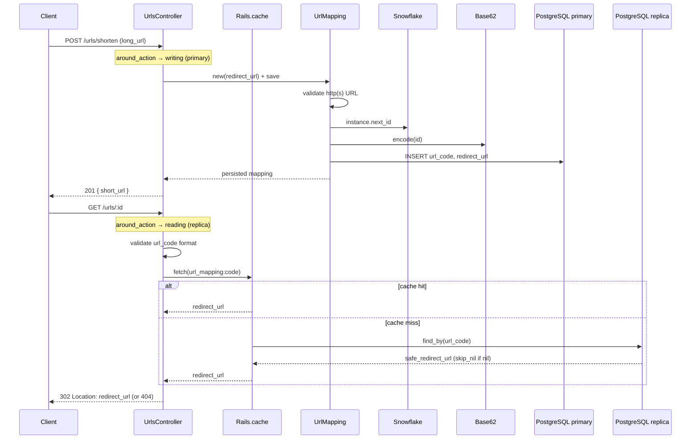

# Case study: URL shortener

Short links: create a mapping from a long URL to a compact code, then redirect on visit.

Rails 8 API app (PostgreSQL). Algorithm deep dives live in [`app/services/snowflake/README.md`](app/services/snowflake/README.md) (Snowflake) and [`app/services/utils/README.md`](app/services/utils/README.md) (Base62).

## Main problem

Accept a long URL, persist a **unique** short code, and redirect visitors to the stored destination when they request `GET /urls/:code`.

## Goals

1. User submits a long URL and gets a short URL back.
2. Visiting the short URL redirects to the long URL.
3. Handle **100 million new URLs per day** and **10 billion redirects per day**.
4. Keep redirects fast and highly available.

Those scale numbers imply a write-heavy create path (~1.2k/s average, much higher at peak) and a far more read-heavy redirect path (~115k/s average). ID generation must not serialize on a single database sequence, and redirects must usually miss the primary.

## Underlying problems

- **Code generation:** How do we produce a unique `url_code` without a hot “does this slug exist?” loop on every create?
- **Persistence:** What do we store (long URL only vs metadata)? How do we index for fast lookup on read-heavy traffic?
- **Redirect semantics:** Which HTTP status should the redirect use so browsers and intermediaries behave predictably (especially if analytics are added later)?
- **Read/write scale:** Redirects dominate; how do caching, a read replica, and rate limits keep the primary writable and the redirect path available?

## Design notes

1. **One row per create:** Each submitted long URL gets its **own** short link, even if another row already points at the same `redirect_url`. There is no deduplication—by design, so every share gets a distinct slug and (future) visit stats.
2. **Redirect-only product surface:** The short URL does not render content; it only resolves `url_code → redirect_url` and issues an HTTP redirect. No HTML, no personalization in the current scope.

## Handling reads vs writes

Creates must hit a **primary**. Redirects are read-only and should not compete with writes on that same instance.

[`ApplicationRecord`](app/models/application_record.rb) declares the two roles:

```ruby
connects_to database: { writing: :primary, reading: :primary_replica }
```

[`ApplicationController`](app/controllers/application_controller.rb) picks the role per request with `connected_to` — **GET/HEAD → replica**, everything else → **primary**. No session, no cookies: this is an API-only app, and the default Rails `DatabaseSelector` (`Resolver::Session`) needs a session store we do not want to add back.

```ruby
around_action :route_to_correct_database

def route_to_correct_database
  role = request.get? || request.head? ? :reading : :writing
  ActiveRecord::Base.connected_to(role: role) { yield }
end
```

- **Writes** (`POST /urls/shorten`) go to `primary`.
- **Reads** (`GET /urls/:id` cache misses) go to `primary_replica`.

Replica hosts/users are in [`config/database.yml`](config/database.yml) (`primary` + `primary_replica` in development, test, and production). `GET /up` uses Rails’ health controller, not `ApplicationController`, so it does not go through this switch.

**Replica lag:** a code created and visited before the replica catches up can 404. The Rails session-based 2-second “read your writes” delay would not help much here anyway — the creator’s POST and a visitor’s GET are usually different clients. Caching on the redirect path (below) absorbs repeat reads; the replica mainly needs to keep up with *new* codes.

## Collision handling

`UrlMapping` inserts the encoded Snowflake id directly. There is no check-then-insert loop (that has a race under concurrent writers).

Uniqueness is enforced at two layers:

1. **Snowflake** — process-scoped generator with a mutex; collisions only arise if two processes share a `machine_id` and mint the same timestamp+sequence.
2. **Unique index on `url_code`** — last-resort DB backstop.

There is **no** application-level `ActiveRecord::RecordNotUnique` retry today. A true collision would fail the create. Collision probability is low when machine ids are unique; adding a bounded insert-retry would be the hardening step if machine-id uniqueness is not guaranteed.

## Limitations (current scope)

- Short URLs are **only** redirects. Nothing is generated or rendered from the slug beyond the lookup.
- Behavior is **deterministic and stateless** at the edge: no auth, no per-user variation, no A/B logic.
- **Machine id** is the trailing digits of the hostname. That is enough for one process per host/pod; Puma workers on the same host still share that ordinal (see Snowflake follow-ups).

## Future additions (not implemented)

- **Analytics:** Log or store visits per `url_code` (requires redirects to hit the app—see [302 vs 301](#redirect-302-found-vs-301-moved-permanently) below).
- **Insert retry** on `ActiveRecord::RecordNotUnique` with a small attempt cap.
- **Unique Snowflake `machine_id` per worker / cluster** (fold in Puma worker index, or lease ids from the DB).

## ID generation: options considered

### 1. Random code + collision check

Generate a random string (e.g. 7 chars from `[a-zA-Z0-9]`), check if it exists, retry on collision.

- **Pros:** Simplest to reason about; no bit-packing or coordination needed.
- **Cons:** Collision probability rises as the table fills; naive "check-then-insert" has a **race condition** under concurrent writers (two requests can both check, both see "free," both insert). Fix is to let the DB's unique constraint catch it via insert-then-rescue, not check-then-insert.

### 2. Database auto-increment + Base62

Use the DB serial, encode with Base62, use that as `url_code`.

- **Pros:** Simple; no separate id service; uniqueness is natural.
- **Cons:** **Predictable** slugs—without auth, anyone can increment/guess encoded ids and hit others’ destinations. **Hard to scale writes** across many app nodes if the DB is the single sequence source. Extra **existence checks** are unnecessary if the sequence is authoritative, but the predictability and DB coupling remain.

### 3. UUIDs

- **Pros:** Opaque, distributed-friendly.
- **Cons:** Long strings (even hex / Base62 UUIDs)—works against “short” URLs.

### 4. Snowflake-style ids (chosen)

64-bit (integer) ids: timestamp + machine + sequence bit fields; encode with Base62 for the path segment.

- **Pros:** Sortable-ish by time, no DB round-trip to “reserve” an id, compact slug after Base62, low collision rate when the generator is used correctly. Fits the 100M creates/day goal without a global sequence bottleneck.
- **Cons:** Requires correct **machine id** and **single generator lifecycle** per process (or per pod) in production; custom epoch and bit layout must stay stable once deployed.

Implemented in [`app/services/snowflake/generator_service.rb`](app/services/snowflake/generator_service.rb); slug encoding in [`app/services/utils/base62_service.rb`](app/services/utils/base62_service.rb). On create, [`UrlMapping`](app/models/url_mapping.rb) runs `encode(Snowflake::GeneratorService.instance.next_id)`.

`new` is private. One generator is memoized per process. Puma’s `before_worker_boot` hook calls `reset!` after fork so workers do not reuse the parent’s mutex and sequence.

### 5. Range / block allocation

A central coordinator assigns each server a numeric range (e.g. Server A: `1_000_000..2_000_000`, Server B: `2_000_001..3_000_000`). Each node allocates from its local pool without hitting the DB for every id.

- **Pros:** Very fast creates at scale; predictable load on coordinator.
- **Cons:** **Coordinator dependency**; **lost ranges** if a node dies or redeploys and discards its block—gaps are acceptable for urls but the ops story is harder, especially with **frequent deploys** when a server restarts and requests a new block while the old block is unused.

**Why Snowflake for this repo:** Good balance of short codes, no central allocator in the experiment, and no guessable sequential slugs—without accepting UUID length.

## Caching frequently accessed codes

The redirect path (`GET /urls/:id`) is read-heavy. [`UrlsController#show`](app/controllers/urls_controller.rb) checks `Rails.cache` before querying PostgreSQL (and therefore before the replica).

**Lookup flow**

1. Reject blank or malformed `url_code` values (must match `UrlMapping::URL_CODE_FORMAT`: 4–11 alphanumeric characters) with **404** — no cache or DB access.
2. `Rails.cache.fetch(UrlMapping.cache_key(code), expires_in: 1.hour, skip_nil: true)` — on miss, load `UrlMapping.find_by(url_code:)` and cache `safe_redirect_url`.
3. **`skip_nil: true`** — do not cache misses, so a code created after an initial failed lookup is found on the next request.
4. **Invalidation** — [`UrlMapping`](app/models/url_mapping.rb) deletes the cache entry on destroy and when `redirect_url` or `url_code` changes.

**Cache store by environment**

| Environment | Store | Notes |
|-------------|-------|-------|
| **Development** | Redis (`redis_cache_store`) | Requires local Redis; see [App setup](#app-setup). Shared across Puma workers. |
| **Production** | Solid Cache (`solid_cache_store`) | DB-backed; no Redis dependency for redirects. |
| **Test** | `:null_store` in config; request specs swap in `MemoryStore` where needed | |

Entries expire after **one hour** via `expires_in`. There is no application-level LRU.

For 10B redirects/day, a shared cache in front of the replica is the intended pattern: hot codes never touch PostgreSQL. Development uses Redis for that locally; production uses Solid Cache.

## Redirect: `302 Found` vs `301 Moved Permanently`

In [`UrlsController#show`](app/controllers/urls_controller.rb) the app uses **`302 Found`** (`status: :found`), not `301`.

| Status | Typical client behavior | Impact on this app |
|--------|-------------------------|-------------------|
| **301** | Browsers and some caches **store** the redirect target; later visits may **skip your server** and go straight to the long URL. | **Analytics and visit counts** on the short link stop seeing traffic; changing the destination later is harder for cached clients. |
| **302** | Treated as **temporary**; clients usually re-request the short URL. | Each click can hit the controller again—better if you add **analytics**, revoke links, or change targets. |

External hosts are allowed via `allow_other_host: true` because destinations are user-supplied `http`/`https` URLs validated on create.

## Rate limiting

[`config/initializers/rack_attack.rb`](config/initializers/rack_attack.rb) throttles by IP (counters live in `Rails.cache`):

| Path | Limit |
|------|-------|
| `POST /urls/shorten` | 50 requests / minute / IP |
| `GET /urls/:code` | 1000 requests / minute / IP |
| `GET /up` | Safelisted (not throttled) |

Over limit returns **429** `{ "error": "Rate limit exceeded, try again later" }`.

## Flow



## Database design

Table: **`url_mappings`**

| Column | Type | Notes |
|--------|------|--------|
| `url_code` | `string`, NOT NULL | Public slug (Base62 snowflake id); lookup key for redirects |
| `redirect_url` | `string`, NOT NULL | Full `http`/`https` URL |
| `created_at` / `updated_at` | `datetime` | Standard Rails timestamps |

**Indexes**

- **Unique index on `url_code`** (`index_url_mappings_on_url_code`): enforces uniqueness at the DB layer and supports fast `find_by(url_code: …)` on the redirect path (O(log n) btree lookup vs full scan).

We do **not** store the raw snowflake integer separately; only the encoded slug. Reversing the id is possible via Base62 decode if ever needed for debugging.

**Not stored (yet):** visit counts, owner user id, expiry, soft delete flags.

## API

| Method | Path | Request | Success | Error |
|--------|------|---------|---------|-------|
| `POST` | `/urls/shorten` | Param **`long_url`** (form/query/body param) | **201** JSON `{ "short_url": "<app url>/urls/<code>" }` | **422** `{ "error": [ "..."] }` validation messages |
| `GET` | `/urls/:id` | `:id` = `url_code` | **302** `Location: redirect_url` | **404** empty body if unknown code |

Rails routes: `resources :urls, only: [:show]` plus collection route `post :shorten`. Health check: `GET /up`.

## Validation and security

On create, `redirect_url` must be present and parse as **`URI::HTTP` / `URI::HTTPS`** with a non-empty **host** (see `long_url_must_be_valid` on [`UrlMapping`](app/models/url_mapping.rb)). Malformed URIs and non-http(s) schemes are rejected before insert. The redirect path calls `safe_redirect_url` again so a bad value written outside validations still 404s instead of redirecting.

`url_code` must match **`URL_CODE_FORMAT`** (`4–11` alphanumeric characters) on create and on the redirect path. Invalid codes return **404** without a DB lookup.

Brakeman flags **open redirects** on `redirect_to` with `allow_other_host: true`; that is intentional for a shortener, gated by the validation above. The ignore entry lives in [`config/brakeman.ignore`](config/brakeman.ignore). After changing the redirect, run `bin/rails brakeman:sync_ignore`.

## Files

| Layer | File | Role |
|-------|------|------|
| Routes | [`config/routes.rb`](config/routes.rb) | `resources :urls`, collection `shorten` |
| Controller | [`app/controllers/urls_controller.rb`](app/controllers/urls_controller.rb) | Create mapping, 302 redirect on show |
| ApplicationController | [`app/controllers/application_controller.rb`](app/controllers/application_controller.rb) | GET/HEAD → replica, other verbs → primary |
| Model | [`app/models/url_mapping.rb`](app/models/url_mapping.rb) | URL validation, snowflake + Base62 on create, cache invalidation |
| ApplicationRecord | [`app/models/application_record.rb`](app/models/application_record.rb) | `connects_to` writing: primary, reading: primary_replica |
| Snowflake | [`app/services/snowflake/generator_service.rb`](app/services/snowflake/generator_service.rb) | Time-ordered 64-bit ids (process singleton + mutex) |
| Base62 | [`app/services/utils/base62_service.rb`](app/services/utils/base62_service.rb) | Compact URL-safe `url_code` |
| Rate limit | [`config/initializers/rack_attack.rb`](config/initializers/rack_attack.rb) | IP throttles for create and redirect |
| Schema | [`db/schema.rb`](db/schema.rb) | `url_mappings` + unique index |
| Database | [`config/database.yml`](config/database.yml) | `primary` + `primary_replica` |

## Tests

| Spec | Covers |
|------|--------|
| [`spec/requests/urls_spec.rb`](spec/requests/urls_spec.rb) | HTTP API (create + redirect + 404), cache hits/misses, format guards |
| [`spec/requests/rack_attack_spec.rb`](spec/requests/rack_attack_spec.rb) | Create throttle (429), health-check safelist |
| [`spec/models/url_mapping_spec.rb`](spec/models/url_mapping_spec.rb) | Validations, `url_code` generation, cache invalidation |
| [`spec/services/utils/base62_service_spec.rb`](spec/services/utils/base62_service_spec.rb) | Slug encode/decode |
| [`spec/services/snowflake/generator_service_spec.rb`](spec/services/snowflake/generator_service_spec.rb) | Id layout, sequence, concurrency |

```bash
bundle exec rspec
```

## Related notes (single-topic)

| Topic | Location |
|-------|----------|
| Base62 alphabet, encode/decode, gotchas | [`app/services/utils/README.md`](app/services/utils/README.md) |
| Snowflake layout, epoch, concurrency, machine id | [`app/services/snowflake/README.md`](app/services/snowflake/README.md) |

## Follow-ups

- [ ] Unique Snowflake `machine_id` per Puma worker / cluster
- [ ] Bounded `RecordNotUnique` retry on create
- [ ] Analytics table + redirect logging

## App setup

Ruby **4.0.2**, Rails **8.1**, PostgreSQL. From the project root you can use `bin/setup`, or the steps below.

### 1. Redis (required in development)

Development uses `redis_cache_store` for the redirect cache and Rack::Attack counters. Tests use `:null_store` and do not need Redis.

**Ubuntu / WSL**

```bash
sudo apt-get update
sudo apt-get install -y redis-server
sudo service redis-server start   # or: redis-server
```

**macOS (Homebrew)**

```bash
brew install redis
brew services start redis
```

Confirm with `redis-cli ping` (`PONG`). Override the default with `REDIS_URL` (falls back to `redis://127.0.0.1:6379`).

### 2. PostgreSQL primary + replica

[`config/database.yml`](config/database.yml) expects:

| Role | Host | Port | Database | User / password |
|------|------|------|----------|-----------------|
| **Primary** (writes) | `localhost` | `5432` | `url_shortener_development` | `postgres` / `postgres` |
| **Replica** (reads) | `localhost` | `5433` | `url_shortener_development` | `postgres_readonly` / `postgres_readonly` |

Test uses the same ports with database `url_shortener_test`. Production uses `URL_SHORTENER_DATABASE_PASSWORD` and `URL_SHORTENER_READONLY_DATABASE_PASSWORD`.

**Primary.** Install PostgreSQL and create the app user/database, or run:

```bash
docker run -d --name url-shortener-primary \
  -e POSTGRES_USER=postgres \
  -e POSTGRES_PASSWORD=postgres \
  -p 5432:5432 \
  postgres:16
```

**Replica.** Streaming replication on port 5433 is the production-shaped setup. A Bitnami primary/replica pair is a typical local stand-in:

```bash
docker network create url-shortener-net

docker run -d --name url-shortener-primary --network url-shortener-net \
  -e POSTGRESQL_USERNAME=postgres \
  -e POSTGRESQL_PASSWORD=postgres \
  -e POSTGRESQL_DATABASE=url_shortener_development \
  -e POSTGRESQL_REPLICATION_MODE=master \
  -e POSTGRESQL_REPLICATION_USER=replicator \
  -e POSTGRESQL_REPLICATION_PASSWORD=replicator \
  -p 5432:5432 \
  bitnami/postgresql:16

docker run -d --name url-shortener-replica --network url-shortener-net \
  -e POSTGRESQL_USERNAME=postgres \
  -e POSTGRESQL_PASSWORD=postgres \
  -e POSTGRESQL_REPLICATION_MODE=slave \
  -e POSTGRESQL_REPLICATION_USER=replicator \
  -e POSTGRESQL_REPLICATION_PASSWORD=replicator \
  -e POSTGRESQL_MASTER_HOST=url-shortener-primary \
  -e POSTGRESQL_MASTER_PORT_NUMBER=5432 \
  -p 5433:5432 \
  bitnami/postgresql:16
```

Create the read-only role on the **primary** (it replicates). Connect to port 5432:

```sql
CREATE USER postgres_readonly WITH PASSWORD 'postgres_readonly';
GRANT CONNECT ON DATABASE url_shortener_development TO postgres_readonly;
GRANT USAGE ON SCHEMA public TO postgres_readonly;
GRANT SELECT ON ALL TABLES IN SCHEMA public TO postgres_readonly;
ALTER DEFAULT PRIVILEGES IN SCHEMA public GRANT SELECT ON TABLES TO postgres_readonly;
```

Repeat `GRANT CONNECT` / `GRANT SELECT` for `url_shortener_test` after `bin/rails db:prepare`.

If you only have a single Postgres on 5432 and no replica yet, the app will fail to connect to `primary_replica` on 5433. Bring the replica up, or temporarily point `primary_replica` at the same host/port (still `replica: true` so Rails will not write to it).

### 3. App

```bash
bundle install
bin/rails db:prepare
redis-server   # or set REDIS_URL to an existing instance
bin/rails server
```

Or `bin/setup` (installs gems, prepares the DB, starts `bin/dev`).

### 4. Tests

```bash
bundle exec rspec
```

CI (`bin/ci`) also runs Brakeman, bundler-audit, and RuboCop. The GitHub Actions test job currently starts **primary Postgres only**; replica-backed request routing is exercised when a replica is available locally.
